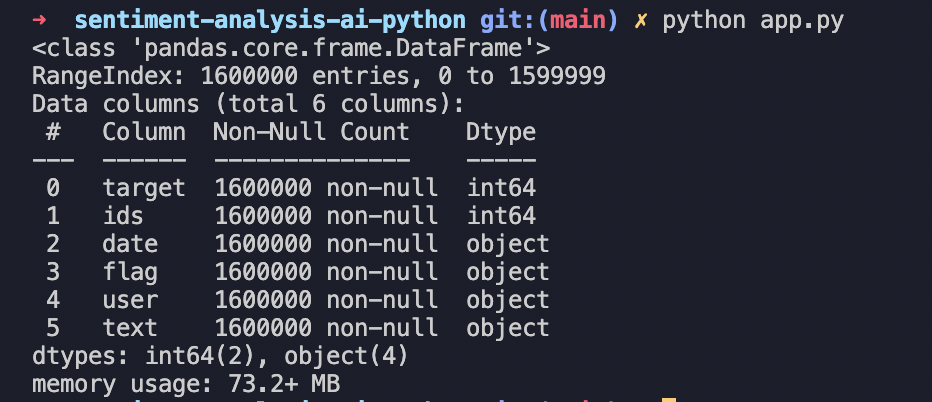

# Sentiment Analysis - Analysis on Twitter Data
To do sentiment analysis by using python, we will use twitter datasets from Kaggle and we will analyse the sentiments by using pandas, wordcloud &amp; matplotlib libraries

# Demo

# Setup Libraries
pip install pandas matplotlib wordcloud re textblob 

## Dataset (Sentiment140 dataset with 1.6 million tweets)
kaggle.com/datasets/kazanova/sentiment140